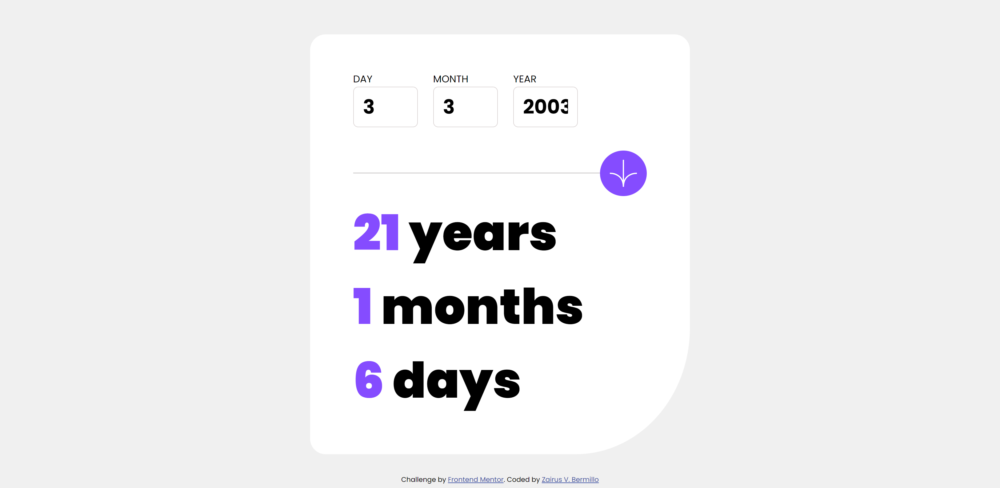

## Table of contents

- [Overview](#overview)
  - [The challenge](#the-challenge)
  - [Screenshot](#screenshot)
  - [Links](#links)
- [My process](#my-process)
  - [Built with](#built-with)
  - [What I learned](#what-i-learned)

## Overview

### The challenge

Users should be able to:

- View an age in years, months, and days after submitting a valid date through the form
- Receive validation errors if:
  - Any field is empty when the form is submitted
  - The day number is not between 1-31
  - The month number is not between 1-12
  - The year is in the future
  - The date is invalid e.g. 31/04/1991 (there are 30 days in April)
- View the optimal layout for the interface depending on their device's screen size
- See hover and focus states for all interactive elements on the page
- **Bonus**: See the age numbers animate to their final number when the form is submitted

### Screenshot

.png)

### Links

- Solution URL: [https://github.com/notZairus/FrontendMentor_AgeCalculator]
- Live Site URL: [https://notzairus.github.io/FrontendMentor_AgeCalculator/]

## My process

### Built with

- HTML
- CSS
- Flexbox
- Javascript

**Note: These are just examples. Delete this note and replace the list above with your own choices**

### What I learned

I learned how to work with Date object.
